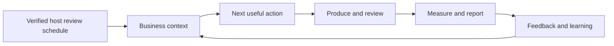

# AI CMO as an ongoing marketing partner

| Layer | User benefit | Honest execution boundary |
| --- | --- | --- |
| Business understanding | Less repeated briefing; goals and voice stay relevant | User-owned context files; actual host persistence required |
| Explainable judgment | One next action with evidence, effort and success signal | Hypotheses stay labeled; no guaranteed outcomes |
| Agentic production | Real assets, review/repair, resumable work | Six native Claude roles; host-supported OpenAI delegation or sequential stages |
| Feedback loop | Corrections improve the next output | Optional local records; no silent publisher telemetry |
| Reporting | A clear result, KPI table, evidence and next decision | Actual metrics/imports; unknown values stay unknown |
| Recurring reviews | Useful follow-up at the agreed cadence | Verified external host scheduling; no plugin daemon |

Start with a focused task. Expand into a campaign or ongoing reviews when useful. Reports are editable Markdown/CSV or an instantiated [HTML template](skills/cmo/references/report-template.html). [The learning loop](skills/cmo/references/learning-loop.md) connects the experience. No fixed increase in intelligence, performance or retention is promised; use outcome evidence to evaluate improvements.
