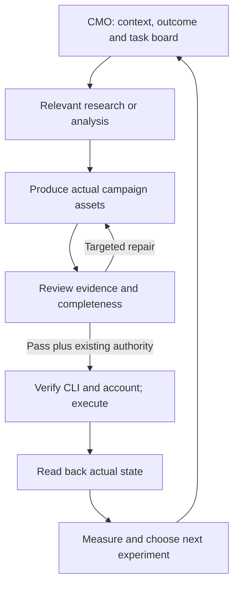

# AI CMO team

The CMO coordinates the work in the main conversation. It adapts goals to the business, keeps a user-owned campaign task board, delegates useful specialist work, checks evidence, delivers actual assets and resumes incomplete tasks.

| Specialist | Responsibility | Handoff |
| --- | --- | --- |
| [Market Intelligence Analyst](skills/cmo/references/role-market-intelligence.md) | Customers, competitors and market evidence | Dated research brief and original hypotheses |
| [Search Strategist](skills/cmo/references/role-search-strategist.md) | Keywords, SEO and AI-search discovery | Intent/page map, content briefs and repair priorities |
| [Campaign Producer](skills/cmo/references/role-campaign-producer.md) | Content, ads, inbound/outbound and field assets | Actual drafts/media briefs plus claim sources |
| [Growth Analyst](skills/cmo/references/role-growth-analyst.md) | Metrics, experiments, retention and referral loops | Checked calculations and scale/iterate/stop decisions |
| [Campaign Reviewer](skills/cmo/references/role-campaign-reviewer.md) | Claims, calculations, brand fit and completeness | Pass/revise/blocked with exact fixes |
| [CLI Operator](skills/cmo/references/role-cli-operator.md) | Authorized tool execution and reconciliation | Prepared requests or observed operation receipts |

The repair path is bounded to one targeted pass by default. Most requests use only two or three relevant specialists; at most two run concurrently, within a four-delegation request budget. Small tasks use one skill. These are instruction defaults, not a bundled scheduler or guaranteed runtime enforcement.

Claude package: 39 skills, six native agents, zero separate commands. OpenAI package: 39 skills, six shared role playbooks and zero native plugin-agent registrations; host-supported delegation or sequential fallback. Existing skills provide direct entry points; a separate command layer is unnecessary.

No background daemon, MCP server, bundled CLI or automatic installation is added. External tools use the user's actual accounts and concrete authorization. Draft quality review cannot authorize publishing, sending or spend. See [the full workflow](skills/cmo/references/agentic-workflow.md) and [scope](SCOPE.md).
